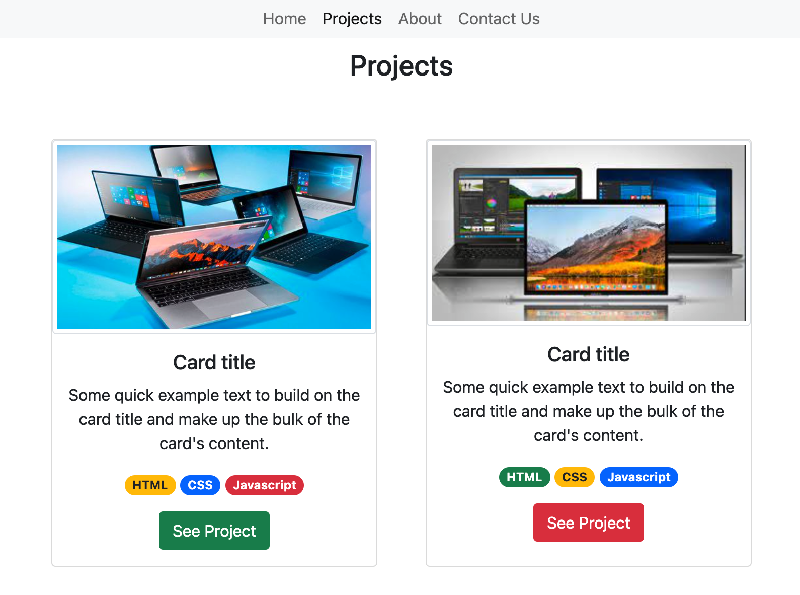

# Bootstrap-Portfolio

> This is a project that we did as part of the Microverse technical curriculum to get familiar with how Bootstrap operates.

The project is a Portfolio built almost exclusively using the Bootstrap framework.

## Built With

### Languages
HTML and CSS

**Frameworks**
Bootstrap

## Authors

👤 **Santiago Velosa**

- GitHub: [@vechicin](https://github.com/vechicin)
- Twitter: [@vechicin](https://twitter.com/vechicin)
- LinkedIn: [Santiago Velosa Arias](https://www.linkedin.com/in/santiago-velosa-arias-5b7543112/)

👤 **Humaira Zaman**

- GitHub: [@qwibbler](https://github.com/qwibbler)
- Twitter: [@hmemaz](https://twitter.com/hmemaz)
- LinkedIn: [Humaira Zaman](https://www.linkedin.com/in/hmemaz1994/)

👤 **Mihreteab Misganaw Aride**

- GitHub: [@Mre55](https://github.com/Mre55)
- Twitter: [@MreMisganaw](https://twitter.com/MreMisganaw)
- LinkedIn: [mihreteab-misganaw](https://www.linkedin.com/in/mihreteab-misganaw-86249812b/)

## 🤝 Contributing

Contributions, issues, and feature requests are welcome!

Feel free to check the [issues page](https://github.com/vechicin/Hello-Microverse/issues).

## Show your support

Give a ⭐️ if you like this project!

## Acknowledgments

- Hat tip to the creators of Bootstrap whose ingenious invention allowed for the creation of this project.

## 📝 License

This project is [MIT](./MIT.md) licensed.
